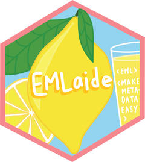

# EMLaide <a href='https://CVPIA-OSC.github.io/EMLaide'></a> 

### Installation
This package can be installed using the following commands: 
```{r}
# install.packages("remotes")
remotes::install_github("CVPIA-OSC/EMLaide")
```
### Overview

This package provides tools to create EML files that are compliant
with the [Environmental Data Initiative](https://portal.edirepository.org/nis/home.jsp) (EDI) standards. The package was designed to meet the specific needs of [CVPIA's](http://cvpia.scienceintegrationteam.com/) data guidance, but can be utilized by any persons wishing to create a working EML document that can be submitted to EDI. Documentation for each function can be found in the Reference tab. The full EML schema can be found on their [website](https://eml.ecoinformatics.org/schema/index.html).

### Usage 
A working template and additional guides can be found under the 'Articles' tab. These articles give step by step instructions for generating EML documents using EMLaide. 


Articles: 

* **[Metadata Template Documentation](https://cvpia-osc.github.io/EMLaide/articles/template-doc.html)** - Instructions for using our [template materials](https://cvpia-data-stewardship.s3-us-west-1.amazonaws.com/metadata+template.zip) to create inputs for our functions to generate an EML document. 
* **[Create EML Document from Template](https://cvpia-osc.github.io/EMLaide/articles/creating-EML.html)** - Step by step instructions of how to generate a full EML document for an [example dataset](https://cvpia-data-stewardship.s3-us-west-1.amazonaws.com/hannon-example.zip). 
* **[Handle Special Case Datasets](https://cvpia-osc.github.io/EMLaide/articles/Dataset-Element.html)** - How to add multiple datasets to one EML document and how to add non tabular data to an EML document. 
* **[EML Custon Units](https://cvpia-osc.github.io/EMLaide/articles/custom-units.html)** - How to add custom units to an EML document. 


