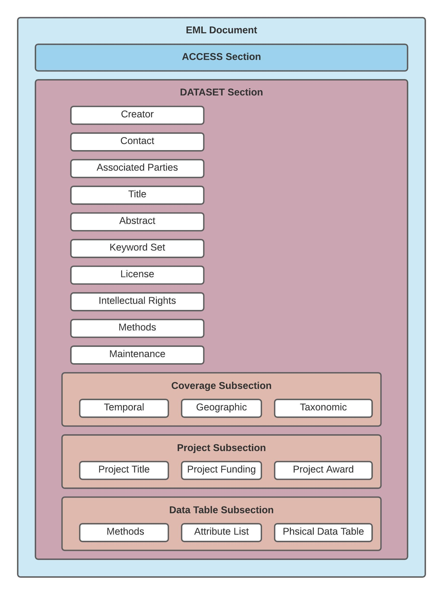

```{r setup, include=FALSE}
knitr::opts_chunk$set(echo = TRUE, message = FALSE, warning = FALSE)
```
The following libraries are needed to create a working EML document. 
```{r, message = FALSE}
library(EDIutils)
library(tidyverse)
library(readxl)
library(EML)

```

## Ecological Metadata Language(EML) Schema Outline 

We use the EML package to generate the EML document based on our metadata inputs. The EML package `write_eml()` function takes in a nested list and formats the list into an EML document. 
To create valid EML the nested list must:

* Contain all required EML fields
* nest all fields under the correct sub sections

We have two main sections within our EML document:

* Access - The [Access Section](https://eml.ecoinformatics.org/schema/eml_xsd.html#eml_access) defines the access for the entire resource(entire EML document)
* Dataset - The [Dataset Resource](https://eml.ecoinformatics.org/schema/eml_xsd.html#eml_dataset) contains the descriptive metadata information on a data set. A data set can contain one or more data entities. A data entity is a tabular data table or a vector or raster image. 

The Dataset element contains all of the additional metadata information. Within the Dataset element we have additional nested lists. Some information is at the top level and is applicable to all elements in the Dataset but other information is nested within subsections and is metadata specific to that subsection. Please refer to the diagram below to see the overall EML structure. 

{width=100%}

For a more in depth description of EML please see [EML Specification.](https://eml.ecoinformatics.org/)

In this document, we can quickly create an EML file which has the opportunity to 
append the following elements. For more detailed instructions on a specific section 
please see section specific articles. 


```yaml
- eml 
  -access
  -dataset
    - creator
    - contact
    - associated parties
    - title  
    - abstract 
    - keyword set  
    - license 
    - methods 
    - maintenance 
    - project
    - coverage 
    - data table 
```

## Our Example 
We will use the data provided by John Hannon to show an example of how to compile
metadata in a valid EML document that can be uploaded to the EDI data portal website. 
To follow along with this example please download the [Hannon-Example](https://s3.console.aws.amazon.com/s3/buckets/cvpia-data-stewardship?region=us-west-1&tab=objects)

### Required Files 
Four files must be uploaded to make a complete EML document. 

* An excel spreadsheet containing the majority of the metadata
* A word document containing the abstract text 
* A word document containing the methods text 
* A file that contains the data (preferably csv if tabular data) and the name of the file 

```{r, include = FALSE}
excel_path <- system.file("extdata", "Hannon-Example", "example-metadata.xlsx", 
                          package = "EDIutils", mustWork = TRUE)

sheets <- readxl::excel_sheets(excel_path)
metadata <- purrr::map(sheets, function(x) readxl::read_excel(excel_path, sheet = x))
names(metadata) <- sheets

abstract_docx <- system.file("extdata", "Hannon-Example", "hannon_example_abstract.docx", 
                             package = "EDIutils", mustWork = TRUE)

methods_docx <- system.file("extdata", "Hannon-Example", "hannon_example_methods.docx", 
                            package = "EDIutils", mustWork = TRUE)

dataset_file <- system.file("extdata", "Hannon-Example", "hannon_example_physical_data.csv",
                               package = "EDIutils", mustWork = TRUE)

dataset_file_name <- "hannon_example_physical_data.csv"

edi_number <- "edi.678.1"
```

```{r, eval = FALSE}
excel_path <- "Hannon-Example/example-metadata.xlsx"

sheets <- readxl::excel_sheets(excel_path)
metadata <- lapply(sheets, function(x) readxl::read_excel(excel_path, sheet = x))
names(metadata) <- sheets

abstract_docx <- "Hannon-Example/hannon_example_abstract.docx"

methods_docx <- "Hannon-Example/hannon_example_methods.docx"

dataset_file <- "Hannon-Example/hannon_example_physical_data.csv"

dataset_file_name <- "hannon_example_physical_data.csv"
```
### EDI Number

In addition to these four files a entity description and an EDI number must be defined. 
The EDI number should be a unique data package identifier. You can reserve this 
data package identifier number on the [EDI data repository under tools.](https://portal.edirepository.org/nis/reservations.jsp)
```{r}
edi_number <- "edi.678.1"
```

It is also possible to use the EDIutils function `api_create_reservation()` to generate a EDI number using R. See the `api_create_reservation()` [documentation.](https://ediorg.github.io/EDIutils/reference/api_create_reservation.html)
```{r}
# edi_number <- api_create_resercation(scope = "edi", environment = "staging", user.id = "your user id", 
#                                      user.pass = "your user password ", affilitation = "EDI")
```


## EML Sections 
We start with the simpler pieces of information such as `personnel` and `title` and 
work up to appending the more complex sections like `dataTable`. 

### Access Permissions 
The `add_access` adds an access section at the beginning of our EML document. The 
`add_access` default is public principal with a read permission. 

```{r}
access <- add_access()
```

### Publication Date 
The publication date is simply added with 
the `add_pub_date` function. If no date is provided, it will automatically append
the current date. This can be overwritten by providing an input for `date`. 

```{r}
pub_date <- add_pub_date(list())
```

### Personnel: Creator, Contact, and Associated Parties. 
The `add_personnel` function allows you to append information on personnel involved in this dataset. EDI schema allows for addition of personel taking on the roles of:

* Creator - any person or organization who is responsible for the creation of the data
* Contact - individual to contact with questions about data (often the creator) 
* Associated Party - any person or organization which is associated to the dataset

Multiple creators, associated parties, and a mixture
of both can be appended to the EML file by providing all inputs in the "personnel"
tab in the "example-metadata.xlsx" excel file. 

Below we create a personnel list. We append each person using an `adds_person()` helper function that provides inputs and calls on our `add_personnel()` function to add each person individually to the `personnel` list. 

```{r}
personnel <- list()
adds_person <- function(first_name, last_name, email, role, organization, orcid) {
  personnel <- add_personnel(personnel, first_name, last_name, email,
                                  role, organization, orcid)
}
personnel <- purrr::pmap(metadata$personnel, adds_person) %>% flatten()
```

### Title and Short Name 
Following the personnel element, we can append the title elements. The `add_title` function 
allows you to append the title and short name of the dataset to the file. 
Only one title and short name should be appended. The title should be 
fairly descriptive and between 7 and 20 words long. The short name must be less than
the number of words present in the title and is your opportunity to give viewers a more 
accessible name to the dataset. This information can be added to the "title"
tab in the excel file "example-metadata.xlsx".

```{r, }
title <- add_title(list(), title = metadata$title$title,  
                   short_name = metadata$title$short_name)
```

### Keyword Set 
The next item we will append is the keyword set. We can use the `add_keyword_set` 
function to do so. The keyword set should include a list of words that help 
identify your project or connect it with other similar projects. If you add keywords
from a controlled vocabulary please see the detailed instructions on 
[initial metadata information](https://cvpia-osc.github.io/EDIutils//articles/Inital-Metadata-Information.html).

```{r}
keywords <- add_keyword_set(list(), metadata$keyword_set[,1])
```

### Abstract
Next, we will use the `add_abstract` function to append the abstract of the dataset to 
your file. The abstract should include basic information on the dataset that gives 
a brief summary to the viewers of what they are observing from the data. This 
information will not be added to the "example-metadata.xlsx" excel sheet, but rather the 
"hannon_example_abstract.docx". 

```{r}
abstract <- add_abstract(list(), abstract = abstract_docx)
```

### License and Intellectual Rights
Following the abstract, we will append the license and intellectual rights information. 
The `add_license` function allows you to append the licensing and usage information 
to your file. If you are not adding a CC0 or CCBY default license please see [initial metadata information](https://cvpia-osc.github.io/EDIutils//articles/Inital-Metadata-Information.html) This information can be added to the 
"license" tab in the excel file "example-metadata.xlsx".

```{r}
license <- add_license(list(), default_license = metadata$license$default_license)
```

### Methods
The method section explains the scientific methods that were used in the collection of the dataset.
The `add_method` function allows you to add a method file to the parent_element.
A template methods document is given ("Hannon-Example/hannon_example_methods.docx"). 
If more methods are needed, you can create separate sections in your word document.

```{r}
methods <- add_method(list(), methods_file = methods_docx)
```

### Maintenance 
The maintenance of a dataset **is simply if the data collection is complete or ongoing.**
The `add_maintenance` function allows you to append the status of the dataset to
your file and the inputs of `complete` and `ongoing` are the only ones allowed.
If the dataset is still in progress, the frequency of which it is updated must 
be provided as well. This information should be added to the "maintenance" tab 
in the excel file "example-metadata.xlsx".

```{r}
maintenance <- add_maintenance(list(), status = metadata$maintenance$status,
                               update_frequency = metadata$maintenance$update_frequency)
```

### Project: Title, Personnel, and Funding 
The project section should be appended next. Project personnel and project funding 
are nested in this project section. To generate a valid EML doc the project section 
must contain a project title, a project personnel, and project funding. 

#### Project personnel 
The creator of the dataset is appended as the `project_personnel`. If a different person is associated with the project please add that information to the "project" tab in the excel file "example-metadata.xlsx". 
```{r}
project_personnel <- personnel$creator 
```

#### Project funding 
The `add_funding` function allows you to append 
both the description of the funding you have received as well as the organization 
you received the funding from. Multiple funders can be appended and 
information should be added to the "funding" tab in the excel file "example-metadata.xlsx".

```{r}
award_information <- purrr::pmap(metadata$funding, add_funding) %>% flatten()
```

#### Combining Project Elements
Once all the components of project have been defined we can use the add_project
function to combine the sections in the proper formatting for an EML document. 
```{r}
project <- add_project(list(), 
                       project_title = metadata$title$short_name, 
                       award_information,
                       project_personnel)
``` 

### Coverage: Geographic, Temporal, Taxonomic 
Next, the coverage information is appended. The `add_coverage` function allows
you to append full coverage information to your file. Temporal, Geographic, and 
Taxonomic Coverage are all required elements to generate an EML document. 

#### Taxonomic coverage 
Taxonomic coverage can be appended using the `add_taxonomic_coverage` function. 
The taxonomic coverage information is added to the "example-metadata.xlsx" 
excel file on the tab "taxonomic_coverage". chinook, delta_smelt, steelhead, 
white_sturgeon, and green_sturgeon are all default options that can be selected 
using the drop down menu under the CVPIA_common_species column.
```{r}
taxonomic_coverage <- purrr::pmap(metadata$taxonomic_coverage, add_taxonomic_coverage)
```

#### Combining Coverage Elements  
The `add_coverage` function will add all the elements of coverage to the parent 
element. 
```{r}
coverage <- add_coverage(list(),
                         geographic_description = metadata$coverage$geographic_description,
                         west_bounding_coordinate = metadata$coverage$west_bounding_coordinate,
                         east_bounding_coordinate = metadata$coverage$east_bounding_coordinate,
                         north_bounding_coordinate = metadata$coverage$north_bounding_coordinate,
                         south_bounding_coordinate = metadata$coverage$south_bounding_coordinate,
                         begin_date = metadata$coverage$begin_date,
                         end_date = metadata$coverage$end_date,
                         taxonomic_coverage = taxonomic_coverage)

```

### Data Table 
Next, we need to create the data table. The data table element includes`physical`, `attribute_list`, 
and potentially additional information for Spatial Data. These sections are all lists 
which must be created first, appended to a dataTable, and then appended to 
the `parent_element`. For more detailed information on the datatable element and 
instructions on appending multiple datatables please see the [dataset specific instructions](https://cvpia-osc.github.io/EDIutils//articles/Dataset-Element.html).

#### Physical 
The physical element can be created first using the `add_physical` function. 
This will append the actual information of the data. 
The file path of the data must be given as the `dataset_file` specified at the top of this document.  

```{r}
physical <- add_physical(file_path = dataset_file)
```

#### Attribute List 
Next, we use the `add_attribute` function to append all attributes to an attribute list. Please make sure you review what 
type of attribute you are providing and what inputs are necessary. These values 
can then be inputted into the "attribute" tab in the "example-metadata.xlsx" excel file. Every single 
column in the dataTable must have a described attribute to match EDI congruence checker. 

#### Enumerated vs. Non Enumerated Attributes
*  If you are using a "nominal" or "ordinal" attribute which is "enumerated", (it has a specific code definition), you must also fill out the tab "code_definitions". The `code_helper()` function below helps adding `codeDefinitions` to the "enumerated" attributes. 
* For Non Enumerated attributes the definition required by EML is simply the `attribute_defintion` given in the spreadsheet. 
```{r}
attribute_list <- list()
# Create helper function to add code definitions if domain is "enumerated"
code_helper <- function(code, definitions, attribute_name) {
  codeDefinition <- list(code = code, definition = definitions)
}
# Adds both enumerated and non enumerated attributes 
adds_attribute <- function(attribute_name, attribute_definition, storage_type, 
                                 measurement_scale, domain, type, units,
                                 unit_precision, number_type, date_time_format, 
                                 date_time_precision, minimum, maximum, 
                                 attribute_label){
  # If statement adds definition for enumerated attribute using code_helper()
  if (domain %in% "enumerated") { 
    definition <- list()
    codes <- metadata$code_definitions
    current_codes <- codes[codes$attribute_name == attribute_name, ] 
    definition$codeDefinition <- purrr::pmap(current_codes, code_helper) 
  # Else statement adds definition for non-enumerated attribute 
  } else {
    definition = attribute_definition
  }
  new_attribute <- add_attribute(attribute_name = attribute_name, 
                                 attribute_definition = attribute_definition,
                                 storage_type = storage_type,
                                 measurement_scale = measurement_scale, 
                                 domain = domain, definition = definition, 
                                 type = type, units = units, 
                                 unit_precision = unit_precision, 
                                 number_type = number_type, 
                                 date_time_format = date_time_format, 
                                 date_time_precision = date_time_precision, 
                                 minimum = minimum, maximum = maximum, 
                                 attribute_label = attribute_label)
}
# Maps through entire attribute sheet adding to attribute_list
attribute_list$attribute <- purrr::pmap(metadata$attribute, adds_attribute) 
```
#### Putting the Data Table Together
Now that we have the `attribute_list` and `physical` information, we 
can compose the data table, which is the last element we need to create our 
working EML file. If you wish to append multiple datatables to one datapackage please view the 
[detailed dataset instructions](https://cvpia-osc.github.io/EDIutils//articles/Dataset-Element.html). 

```{r}
dataTable <- list(entityName = dataset_file_name,
                 entityDescription = metadata$dataset$name,
                 physical = physical,
                 attributeList = attribute_list)

```
## Append all items to the dataset
Here we  create a datasest list that contains all of the elements we generated.
```{r}
dataset <- list(title = title$title,
                shortName = title$shortName,
                creator = personnel$creator,
                contact = personnel$contact,
                pubDate = pub_date,
                abstract = abstract$abstract,
                associatedParty = list(personnel[[3]], personnel[[4]], personnel[[5]]),
                keywordSet = keywords$keywordSet,
                coverage = coverage$coverage,
                intellectualRights = license$intellectualRights,
                licensed = license$licensed,
                methods = methods,
                maintenance = maintenance$maintenance,
                dataTable = dataTable) 

```
## Making the EML document 
Now that we have all of the items appended to the `dataset` we can add the dataset, id, and access to a new list named eml. 
The unique id number should match one that you reserved on the EDI data portal. Input this at the top of the 
document where you define the data tables. 
```{r}
eml <- list(packageId = edi_number,
            system = "EDI",
            access = access,
            dataset = dataset)
```
The final step is to convert our `eml` list into the correct format. To do so, we can use the EML library's `write_eml` function. 
```{r, eval = FALSE}
file_name <- paste(edi_number, "xml", sep = ".")
EML::write_eml(eml, file_name)
eml_validate(file_name)
```

## Uploading to EDI Data Repository 
If you feel ready to upload your document to the EDI data repository you can do that from R using the Environmental Data Initiatives EDIutils package. Use the `api_create_data_package()` to create the initial version of a data package. 

In order to upload from R you must have the data table accessible by a URL that can be accessed through the EDI repository. This URL must be added in the `add_physical()` section above. If you do not have a URL available then you can upload the EML document and the dataset on the [EDI data portal.](https://portal.edirepository.org/nis/home.jsp)

```{r}
#api_create_data_package()
```

